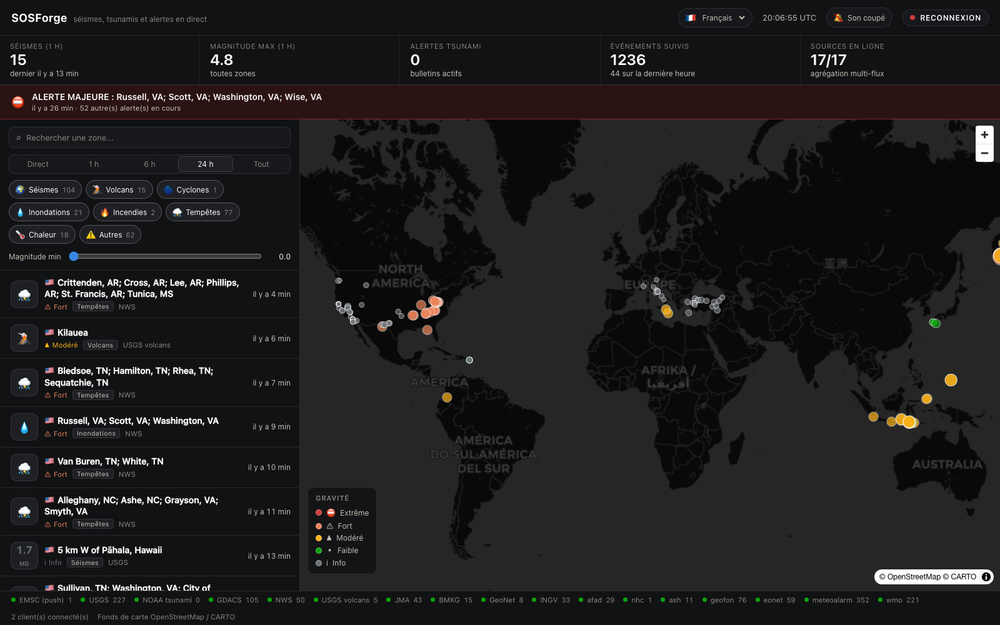

# SOSForge

[](https://github.com/SoCloseSociety/SOSForge/actions/workflows/ci.yml)
[](https://sosforge.185.246.86.143.nip.io)
[](LICENSE)

**En ligne: <https://sosforge.185.246.86.143.nip.io>**

Suivi **temps reel** des seismes, tsunamis, volcans, cyclones et alertes
catastrophes. Un flux unique, agrege depuis **dix-neuf sources officielles**,
diffuse a la seconde vers le navigateur par websocket. Interface en cinq langues.

Aucune cle d'API n'est necessaire: les dix-neuf sources sont publiques et ouvertes.



<sub>Sur telephone, le flux passe devant et la carte dessous: on lit d'abord, on
explore ensuite. [Capture mobile](docs/screenshot-mobile.png).</sub>

## Le principe

Le "live a la seconde" ne vient pas d'un polling agressif d'une seule API. Il
vient d'un **fan-in** de sources heterogenes, normalisees dans un seul modele
d'evenement, puis d'un **fan-out** websocket vers les clients.

```
EMSC websocket (push)      \
USGS GeoJSON (5 s)          \
JMA / BMKG / GeoNet          \
INGV / AFAD (45-60 s)         >--> normalize --> horizon --> dedupe --> ring --> hub --> /ws --> UI
NOAA tsunami.gov (30 s)      /
NWS api.weather.gov (20 s)  /
NHC cyclones (300 s)       /
SIGMET cendres (180 s)    /
GDACS RSS (120 s)        /
USGS HANS volcans (300 s)

                                                          + tick serveur chaque seconde
```

L'EMSC est la seule source **push**: elle pousse le seisme des qu'il est
localise, sans attendre un cycle. Les autres sont des sources polling dont la
cadence est calee sur leur frequence reelle de publication -- poller USGS plus
vite que sa regeneration ne rendrait rien de plus.

## Les dix-neuf sources (aucune cle API requise)

**Mondiales**

| Source | Endpoint | Mode | Apporte |
|---|---|---|---|
| EMSC seismicportal | `wss://www.seismicportal.eu/standing_order/websocket` | push | seismes monde, en quelques secondes |
| USGS | `earthquake.usgs.gov/.../all_hour.geojson` | poll 5 s | seismes + drapeau tsunami + niveau PAGER |
| NOAA NTWC / PTWC | `tsunami.gov/events/xml/PAAQAtom.xml`, `PHEBAtom.xml` | poll 30 s | bulletins tsunami (Information / Watch / Advisory / Warning) |
| GDACS | `gdacs.org/xml/rss.xml` | poll 120 s | cyclones, inondations, feux, volcans, secheresses, avec niveau vert/orange/rouge |
| SIGMET cendres (AWC) | `aviationweather.gov/api/data/isigmet?hazard=VA` | poll 180 s | **cendres volcaniques structurees, monde entier** -- le seul flux machine-lisible equivalent aux VAAC |
| NHC | `nhc.noaa.gov/CurrentStorms.json` | poll 300 s | cyclones tropicaux Atlantique et Pacifique: position, vents, categorie, advisory |
| GEOFON (GFZ) | `geofon.gfz.de/eqinfo/list.php?fmt=geojson` | poll 60 s | troisieme catalogue mondial: le dedup passe d'un accord a deux a un **vote a trois** |
| NASA EONET | `eonet.gsfc.nasa.gov/api/v3/events` | poll 600 s | evenements naturels en cours vus de l'espace: **feux de forets suivis comme des evenements**, second avis sur les tempetes |
| OMM (agregat CAP) | `severeweather.wmo.int/json/wmo_all.json` | poll 300 s | alertes officielles du reste du monde (Inde, Chine, Indonesie, Amerique du Sud) en un appel |

**Nationales et regionales** -- elles ne sont pas la pour la redondance: chacune apporte ce que l'EMSC n'a pas.

| Source | Endpoint | Mode | Apporte |
|---|---|---|---|
| NWS (USA) | `api.weather.gov/alerts/active` | poll 20 s | crues, tornades, chaleur, tsunami cote americain |
| USGS HANS + Smithsonian | `volcanoes.usgs.gov/hans-public/api/...` | poll 300 s | volcans US en alerte (code couleur aviation), positionnes via le catalogue GVP |
| JMA (Japon) | `jma.go.jp/bosai/quake/data/list.json` | poll 45 s | le **shindo**, l'intensite ressentie au sol -- ce qui compte au Japon, et qui n'existe nulle part ailleurs |
| BMKG (Indonesie) | `data.bmkg.go.id/DataMKG/TEWS/gempaterkini.json` | poll 60 s | le **potentiel tsunami officiel indonesien**, publie avant les bulletins du PTWC |
| GeoNet (Nouvelle-Zelande) | `api.geonet.org.nz/quake?MMI=3` | poll 60 s | seuil de detection local tres bas sur une zone tres active |
| INGV (Italie) | `webservices.ingv.it/fdsnws/event/1/query` | poll 60 s | idem, et au format FDSN standard (le meme contrat que l'USGS) |
| AFAD (Turquie) | `deprem.afad.gov.tr/apiv2/event/filter` | poll 60 s | couverture fine de la faille nord-anatolienne |
| Meteoalarm (Europe) | `feeds.meteoalarm.org/api/v1/warnings/feeds-{pays}` | poll 300 s | vigilances des services meteo nationaux de dix pays europeens |
| JMA alerte precoce | `api.wolfx.jp/jma_eew.json` | poll 5 s | **la seule source emise PENDANT la propagation des ondes**, avant l'arrivee des secousses |
| CENC (Chine) | `api.wolfx.jp/cenc_eqlist.json` | poll 120 s | Chine continentale, sans autre couverture ici |

## Deploiement

Le service tourne sur le VPS SoClose derriere le nginx de l'hote, qui porte le
TLS et le nom de domaine; le conteneur, lui, n'ecoute que sur la loopback.

```bash
ssh hub
cd /root/SAAS/sosforge && git pull && docker compose up -d --build
```

| | |
|---|---|
| Chemin sur le serveur | `/root/SAAS/sosforge` |
| Port interne | `127.0.0.1:8380` (nginx de l'hote proxifie dessus) |
| Vhost | `/etc/nginx/sites-available/sosforge.soclose.co` |
| Certificat | `certbot certonly --webroot -w /var/www/certbot -d <nom>` |
| Donnees | volume docker `sos-data` (journal JSONL, purge a 7 jours) |

L'entete de securite est posee cote hote: CSP restrictive (le site ne charge que
son propre code, les tuiles CARTO et le websocket), `nosniff`, HSTS, et une
redirection permanente de HTTP vers HTTPS.

## Demarrage

```bash
cp .env.example .env      # rien a remplir: tout est public
make install              # venv backend + npm install
make dev-api              # terminal 1 -- API sur :8300
make dev-web              # terminal 2 -- UI sur :5273
```

En docker: `make up` puis <http://localhost:8380>.

## API

| Route | Ce qu'elle rend |
|---|---|
| `GET /healthz` | etat du service, nombre de clients, evenements ingeres |
| `GET /api/events` | flux recent. Filtres: `limit`, `kind`, `min_magnitude`, `hours`, `primary_only` |
| `GET /api/events/{id}` | un evenement avec son payload source brut |
| `GET /api/events/{id}/nearby` | vues en direct de la zone: liens profonds + webcams |
| `GET /api/geocode?q=` | recherche de zone (proxy Nominatim, cadence et cache) |
| `GET /api/stats` | compteurs de la derniere heure |
| `GET /api/sources` | sante de chaque source (connectee, evenements vus, derniere erreur) |
| `WS /ws` | snapshot a la connexion, puis `event` / `update` / `tick` (1/s) |

Messages websocket:

```jsonc
{"type": "snapshot", "events": [...], "stats": {...}, "sources": [...]}
{"type": "event",    "event": {...}, "primary": true, "breaking": true}   // nouvel evenement
{"type": "update",   "event": {...}, "primary": true, "breaking": false}  // revision d'un evenement connu
{"type": "tick",     "server_time": "...", "stats": {...}}  // battement, chaque seconde
```

### Une source d'une autre nature: l'alerte precoce

Les dix-huit autres sources publient **apres** coup: un seisme a eu lieu, une
agence le localise, on l'affiche. L'alerte precoce japonaise (EEW) est emise
**pendant** la propagation des ondes, quelques secondes apres la detection par
les stations les plus proches. C'est la seule information de ce produit qui
puisse encore servir a se mettre a l'abri.

**Reserve assumee.** La JMA et le CENC n'exposent pas d'API ouverte: on passe par
le relais **tiers non officiel** Wolfx. C'est une source "au mieux": elle
enrichit, elle ne fait autorite sur rien, et sa panne ne casse rien. Ses
websockets refusent les clients non navigateur (403 Cloudflare), d'ou le polling.
Elle se coupe avec `SOS_ENABLE_JMA_EEW=false`.

## L'interface

- **Fenetre temporelle**: Direct (15 min), 1 h, 6 h, 24 h, Tout. C'est la premiere
  question qu'on se pose devant un tracker, donc le premier controle de la page.
- **Cinq langues** (francais, anglais, espagnol, japonais, indonesien), detectees
  sur le navigateur. Les deux dernieres ne sont pas decoratives: ce sont les
  populations les plus exposees aux seismes et aux tsunamis, et justement celles
  que les sources JMA et BMKG servent.
- **Drapeau du pays** sur chaque evenement, resolu cote serveur. Pas de pays
  identifiable (haute mer)? Un globe, jamais un drapeau approximatif.
- **Recherche de zone**: taper un nom filtre le flux instantanement (lieu, titre,
  pays) *et* propose d'aller a cette zone sur la carte, meme si rien ne s'y passe
  -- c'est le cas le plus utile en situation reelle. Le geocodage passe par le
  backend, qui tient la cadence d'une requete par seconde imposee par Nominatim.
- **Lien partageable**: chaque evenement a son URL (`#e/<id>`). Sans elle, on ne
  pouvait pas dire "regarde CE seisme" -- le destinataire tombait sur un flux qui
  avait deja bouge. Le bouton de la fiche copie le lien.
- **Filtres memorises**: fenetre, types et magnitude survivent au rechargement.
  La recherche texte, non: retrouver un filtre invisible qui masque tout le flux
  serait deroutant.
- **Clic sur un evenement**: la carte plonge au plus pres de la zone, et une fiche
  ouvre les **vues en direct** -- webcams Windy, recherche YouTube live, imagerie
  satellite NASA Worldview du jour, vue satellite. Ces liens marchent sans aucune
  cle; avec une cle Windy (`SOS_WINDY_API_KEY`), la liste reelle des webcams
  publiques a proximite s'affiche avec vignettes.

## Ce que le systeme gere explicitement

- **Revisions.** EMSC et USGS revisent leurs solutions dans les minutes qui
  suivent. Un evenement deja connu dont l'empreinte change devient une `update`,
  pas un doublon. L'UI marque la ligne "revise".
- **Dedup inter-sources.** Le meme seisme arrive sous deux identifiants (EMSC et
  USGS). Il est regroupe en cluster: 90 s, 250 km et 1.2 point de magnitude
  d'ecart maximum. Rien n'est supprime, un seul representant est affiche.
- **Volume des agregats d'alertes.** Meteoalarm et l'OMM deversent ~4300
  bulletins par cycle, essentiellement de la pluie et de la chaleur de routine:
  ils enterreraient seismes et tsunamis. Seuils obligatoires -- orange et rouge
  pour Meteoalarm (92 vigilances francaises ramenees a 7), tiers superieur pour
  l'OMM (2258 ramenees a 221). Reserve mesuree: l'echelle de gravite de l'OMM
  n'est pas homogene d'un pays a l'autre, des "Small Craft Advisory" americains
  arrivent au meme rang que des cyclones.
- **Alertes sans position.** Meteoalarm et l'OMM decrivent leurs zones par des
  codes administratifs (NUTS3), sans coordonnees. Ces alertes vivent dans le
  flux, pas sur la carte -- et c'est dit plutot que masque.
- **Bruit GDACS.** Le flux complet, c'est ~400 entrees dont ~344 feux verts et des
  secheresses ouvertes depuis un an. Filtre: orange et rouge toujours, vert
  seulement s'il vient d'etre publie (`SOS_GDACS_MAX_AGE_DAYS`).
- **Bulletins "pas de danger".** Un bulletin tsunami de categorie Information dit
  en general "there is NO tsunami danger": il est affiche, mais ne leve pas
  l'alerte tsunami et ne declenche pas le son.
- **Connexion morte.** Un websocket peut rester "open" sans plus rien livrer. Le
  tick serveur d'une seconde sert de preuve de vie: 15 s de silence et le client
  reconnecte au lieu d'afficher un flux fige en pretendant qu'il est live.
- **Client lent.** Sa file est bornee; s'il ne suit pas, il est ejecte plutot que
  de ralentir l'ingestion.
- **Pas de WebGL.** La carte se desactive proprement, le flux d'alertes continue.
- **Archives contre actualite.** Plusieurs sources servent un catalogue et non un
  flux: la liste JMA remonte a plus de neuf mois. Un horizon d'ingestion
  (`SOS_MAX_EVENT_AGE_DAYS`) les ecarte, avec une nuance qui compte: une alerte
  grave **et en cours** (cyclone rouge) survit, un seisme passe non -- un seisme
  est instantane, il ne "dure" pas.
- **Ondes en propagation.** Pour un seisme de magnitude 4 ou plus survenu il y a
  moins de six minutes, la carte trace les deux fronts d'onde en direct: **P** a
  6 km/s (premiere secousse) et **S** a 3,5 km/s (celle qui fait les degats). Ce
  n'est pas decoratif: c'est la seule chose de l'interface qui montre **ou les
  secousses arrivent maintenant**. Vitesses crustales moyennes, donc justes pres
  de l'epicentre et approximatives loin -- les cercles s'arretent a 1200 km,
  avant de devenir mensongers.
- **Alerte terminee.** Une alerte "en cours" (feu EONET, cyclone NHC, alerte
  GDACS courante) echappe a l'horizon tant que sa source la publie. Mais un
  balayage retire celles qu'aucune source ne mentionne plus depuis six heures:
  une source qui se tait a implicitement dit que c'etait fini.
- **Preavis d'une vigilance.** Une alerte meteo est publiee AVANT son debut --
  c'est tout son interet. Son horodatage est donc legitimement dans le futur, et
  le filtre anti-futur l'exempte quand elle est declaree en cours. Un seisme, lui,
  ne peut pas etre date en avance.
- **Horodatage dans le futur.** Une source dont l'horloge derive produisait un
  evenement d'age negatif: horizon franchi, annonce "en direct" en permanence, et
  cloue en tete du flux trie par date. Au-dela de deux minutes d'avance, rejete.
- **Retention du journal.** Le journal JSONL grossit d'environ 5 Mo par jour.
  Un balayage supprime ceux de plus de `SOS_JOURNAL_KEEP_DAYS` jours: sur un
  service qui tourne en continu, personne ne surveille un disque qui se remplit.
- **Taches de fond qui meurent.** Le battement d'une seconde et le balayage
  attrapent leurs exceptions. Une seule erreur non rattrapee tuait la tache pour
  de bon: plus aucun tick, tous les clients en reconnexion, et `/healthz` qui
  repondait "ok" pendant ce temps.
- **Panne d'une source.** Une source dont tous les flux echouent ne peut pas
  s'afficher verte. Le pied de page montre l'etat reel des dix-neuf.

## Verification

```bash
make test        # 95 tests backend: normalizers sur payloads reels, store, pipeline, non-regressions d'audit
cd frontend && npx vitest run   # 77 tests frontend: filtres, ingestion, i18n, rendu
make lint
make typecheck   # tsc + mypy
make smoke       # etat live des dix-neuf sources
```

## Choix d'architecture

**Pas de base de donnees en v1.** Un tracker live a besoin de la derniere heure,
pas d'un entrepot: ring buffer en memoire (5000 evenements) plus un journal JSONL
par jour pour l'audit et le rejeu. `EventStore` est l'unique point de stockage --
Postgres se branche derriere la meme interface le jour ou l'historique devient un
besoin produit.

**Ecartes volontairement, apres verification.** FIRMS et EFFIS (feux): latence
NRT d'environ 3 h et aucun identifiant d'evenement -- le "feu a la seconde"
n'existe chez personne. SeedLink et Raspberry Shake: des formes d'onde, pas des
evenements. GloFAS et Copernicus EMS: cle obligatoire, et GDACS republie deja
l'essentiel. L'API BOM (Australie) fonctionne mais son propre payload interdit
la reutilisation. Meteoalarm (Europe) et l'agregat CAP de l'OMM sont verifies et
en attente: ils valent une integration a eux seuls.

**La gravite est une palette "status", pas une palette de series.** Cinq niveaux,
couleurs reservees, et **jamais la couleur seule**: chaque niveau porte aussi un
glyphe et un libelle, pour rester lisible en vision des couleurs deficiente comme
en impression noir et blanc.

## Sources et attributions

Donnees: EMSC/CSEM, USGS, NOAA (NWS, NTWC, PTWC, NHC, Aviation Weather Center),
GDACS (Commission europeenne et ONU), Smithsonian Institution Global Volcanism
Program, JMA (Japon), BMKG (Indonesie), GNS Science / GeoNet (Nouvelle-Zelande),
INGV (Italie), AFAD (Turquie). Fonds de carte
OpenStreetMap et CARTO. Ces flux sont publics; ils reviennent a leurs producteurs.

**SOSForge n'est pas un service d'alerte officiel.** En cas d'alerte reelle,
la reference est l'autorite de securite civile locale.
